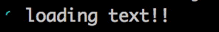

# loading-cli

[](https://www.npmjs.com/package/loading-cli) [](https://travis-ci.org/jaywcjlove/loading-cli)

Terminal loading effect.



# Install

```bash 
$ npm install --save loading-cli
```

# Usage

```js 
var loading =  require('loading-cli');
var load = loading("loading text!!")

load.start()

setTimeout(function(){
    load.color = 'yellow';
    load.text = ' Loading rainbows';
},2000)

// stop
setTimeout(function(){
    load.stop()
},3000)
```

# API

## loading([options|text])

### options 

```js
load({
    "text":"loading text!!",
    "color":"yellow",
    "interval":100,
    "stream": process.stdout,
    "frames":["◰", "◳", "◲", "◱"]
})
```

### text

Type: string
Text to display after the spinner.

```js
loading("loading text!!")
```

## color

Values:`black` `red` `green` `yellow` `blue` `magenta` `cyan` `white` `gray`   


## frames

```bash
["◰", "◳", "◲", "◱"]
["◐", "◓", "◑", "◒"]
[".", "o", "O", "°", "O", "o", "."]
["⊶", "⊷"]
["ဝ", "၀"]
["←", "↖", "↑", "↗", "→", "↘", "↓", "↙"]
["🕐 ", "🕑 ", "🕒 ", "🕓 ", "🕔 ", "🕕 ", "🕖 ", "🕗 ", "🕘 ", "🕙 ", "🕚 "]
```


# Instance


## .start()

Start the spinner. Returns the instance.

## .stop()

Stop and clear the spinner. Returns the instance.

## .clear()

Clear the spinner. Returns the instance.

## .render()

Manually render a new frame. Returns the instance.

## .frame()

Get a new frame.

## .text

Change the text.

## .color

Change the spinner color.
